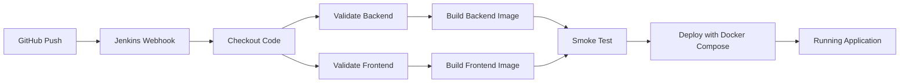

# UniGuard DevOps Implementation Guide

This document explains how to add a beginner-friendly DevOps workflow to the UniGuard project using GitHub, Jenkins, Docker, and CI/CD automation.

## 1. Project Summary

UniGuard is a login anomaly detection system for university IT environments. The repository contains:

- A FastAPI backend in `backend/main.py`
- A React + Vite frontend in `frontend/`
- ML and preprocessing scripts in the project root

The DevOps setup below turns the repository into a containerized, buildable, and deployable application.

## 2. Proper DevOps Workflow Explanation

1. Developer pushes code to GitHub.
2. Jenkins gets triggered by a webhook or manual build.
3. Jenkins checks the backend and frontend build steps.
4. Docker images are built for both services.
5. A smoke test verifies the health endpoint and UI.
6. Jenkins deploys the application using Docker Compose.
7. The app runs as two containers: backend API and frontend UI.

This gives you automation, repeatability, and easier demonstration of deployment practices.

## 3. CI/CD Pipeline Architecture



## 4. Dockerfile Based on Project Stack

The repository now includes:

- `backend/Dockerfile` for the FastAPI service
- `frontend/Dockerfile` for the React build and Nginx hosting
- `docker-compose.yml` for local orchestration and deployment

### Backend Dockerfile

- Base image: `python:3.11-slim`
- Installs Python dependencies from `backend/requirements.txt`
- Runs FastAPI with Uvicorn on port `8000`
- Exposes a `/health` endpoint for health checks

### Frontend Dockerfile

- Build stage: `node:20-alpine`
- Production stage: `nginx:1.27-alpine`
- Nginx serves the React build and proxies `/api` to the backend

## 5. Jenkins Pipeline Script

The `Jenkinsfile` contains a declarative pipeline with these stages:

- Checkout
- Validate Backend
- Validate Frontend
- Build Docker Images
- Smoke Test
- Deploy

## 6. GitHub Integration Steps

1. Push the repository to GitHub.
2. Open your Jenkins job configuration.
3. Select the GitHub repository as the source.
4. Add the repository URL and credentials if required.
5. Enable GitHub webhook trigger.
6. In GitHub, add a webhook pointing to Jenkins.

Webhook URL example:

```text
http://YOUR_JENKINS_URL/github-webhook/
```

## 7. Complete Installation and Setup Commands

### Ubuntu packages

```bash
sudo apt update
sudo apt install -y curl git docker.io docker-compose-plugin openjdk-17-jdk
sudo usermod -aG docker $USER
newgrp docker
```

### Python backend

```bash
cd /workspaces/Unusual-Login-Activity-Detection-in-University-IT-Systems/backend
python3 -m venv .venv
. .venv/bin/activate
pip install --upgrade pip
pip install -r requirements.txt
```

### Frontend

```bash
cd /workspaces/Unusual-Login-Activity-Detection-in-University-IT-Systems/frontend
npm ci
npm run build
```

## 8. Docker Build and Run Commands

### Build images

```bash
docker build -t uniguard-backend ./backend
docker build -t uniguard-frontend ./frontend
```

### Run with Docker Compose

```bash
docker compose up -d --build
```

### Stop the stack

```bash
docker compose down
```

## 9. Jenkins Configuration Steps

1. Install Jenkins and the required plugins:
   - GitHub plugin
   - Pipeline plugin
   - Docker plugin
   - Credentials plugin
2. Ensure Docker is installed on the Jenkins node.
3. Create a pipeline job.
4. Set the GitHub repository as the source.
5. Choose `Pipeline script from SCM`.
6. Point Jenkins to the `Jenkinsfile` in the repository root.
7. Configure webhook or polling.

## 10. Project Deployment Steps

1. Merge code into the main branch.
2. Push to GitHub.
3. Jenkins runs the pipeline automatically.
4. Docker images are built.
5. Containers start through Docker Compose.
6. Open the application:
   - Frontend: `http://localhost:3000`
   - Backend API: `http://localhost:8000`

## 11. Explanation of Every Pipeline Stage

### Checkout

Downloads the latest source code from GitHub.

### Validate Backend

Creates a Python virtual environment, installs dependencies, and checks syntax with `py_compile`.

### Validate Frontend

Installs Node.js dependencies and confirms the React app builds successfully.

### Build Docker Images

Builds production-ready container images for backend and frontend.

### Smoke Test

Starts the stack and verifies the health endpoint and frontend response.

### Deploy

Keeps the stack running with Docker Compose.

## 12. Folder Structure if Needed

```text
Unusual-Login-Activity-Detection-in-University-IT-Systems/
├── backend/
│   ├── Dockerfile
│   ├── .dockerignore
│   ├── main.py
│   └── requirements.txt
├── frontend/
│   ├── Dockerfile
│   ├── nginx.conf
│   ├── .dockerignore
│   └── src/
├── docker-compose.yml
├── Jenkinsfile
├── README.md
└── DEVOPS_IMPLEMENTATION.md
```

## 13. Troubleshooting Common Errors

### Docker permission denied

Run:

```bash
sudo usermod -aG docker $USER
newgrp docker
```

### Jenkins cannot run Docker

Make sure the Jenkins user is in the docker group and Docker is running.

### Frontend API calls fail

Check that the frontend uses the relative `/api` path and that Nginx proxies to the backend.

### Backend container exits immediately

Confirm `backend/main.py` starts correctly and that all Python packages are installed.

### Port already in use

Check and stop old containers:

```bash
docker ps
docker compose down
```

## 14. Commands for Linux/Ubuntu

```bash
sudo apt update
sudo apt install -y docker.io docker-compose-plugin openjdk-17-jdk curl git
docker --version
docker compose version
java -version
```

## 15. Screenshots to Capture for Presentation

1. GitHub repository homepage
2. Jenkins job configuration page
3. Jenkins pipeline console output
4. Docker image build logs
5. `docker compose up` terminal output
6. Backend health endpoint in browser
7. Frontend dashboard running in browser
8. Jenkins successful build badge or status page

## 16. Viva Questions With Answers

### What is DevOps?

DevOps is a practice that combines development and operations to automate build, test, and deployment workflows.

### Why use Docker?

Docker packages the application and its dependencies into portable containers.

### Why use Jenkins?

Jenkins automates CI/CD pipelines and reduces manual deployment steps.

### What is CI/CD?

CI means Continuous Integration, and CD means Continuous Delivery or Deployment.

### Why is a health endpoint useful?

It helps Docker and Jenkins verify that the backend is running correctly.

## 17. Two-Minute Presentation Explanation Script

"UniGuard is a login anomaly detection system for university IT environments. I added a DevOps workflow using GitHub, Jenkins, and Docker so the project can be built and deployed automatically. When code is pushed to GitHub, Jenkins pulls the repository, validates the Python backend and React frontend, builds Docker images, runs a smoke test, and then deploys the application using Docker Compose. The backend runs as a FastAPI service, and the frontend is served by Nginx inside a production Docker container. This makes the project portable, repeatable, and easier to maintain. The main benefit is that the same pipeline can be reused for future updates with minimal manual work."

## 18. ATS-Friendly Resume Project Description

**UniGuard DevOps Automation for Login Anomaly Detection**

Built and automated a containerized CI/CD pipeline for a FastAPI and React-based anomaly detection platform using GitHub, Jenkins, Docker, and Docker Compose. Implemented production-ready Dockerfiles, health checks, automated build validation, smoke testing, and deployment orchestration to improve reliability, portability, and release consistency.

## 19. Professional GitHub README Content

Use the root `README.md` for a polished summary of the project, setup instructions, Docker run steps, and a link to this guide for the full DevOps explanation.

## 20. Advantages and Future Scope of the Implementation

### Advantages

- Automated builds and deployments
- Easier demo for college presentation
- Portable environment across machines
- Better repeatability and fewer manual errors
- Clear separation between frontend and backend

### Future Scope

- Add automated testing with pytest and frontend unit tests
- Push images to Docker Hub or GitHub Container Registry
- Add GitHub Actions in addition to Jenkins
- Add monitoring with Prometheus and Grafana
- Deploy to cloud platforms such as AWS, Azure, or Render

## 21. Final Project Conclusion

This DevOps implementation makes UniGuard a complete end-to-end project: code changes are pushed to GitHub, Jenkins automates validation and deployment, Docker standardizes the runtime, and Docker Compose keeps the full stack easy to run locally or in a demo environment.